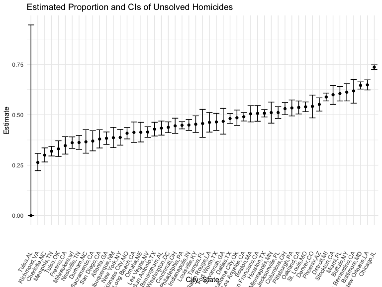
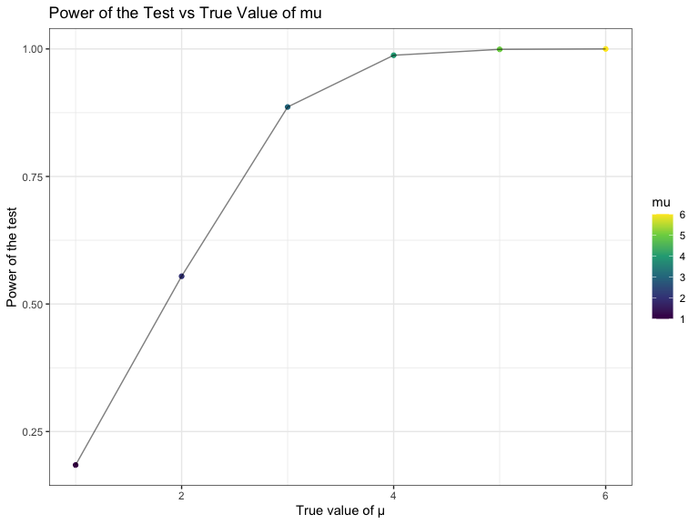
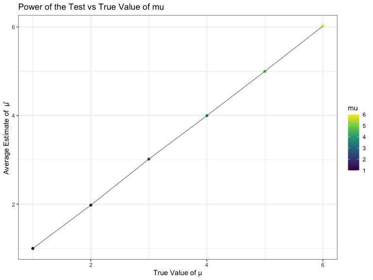
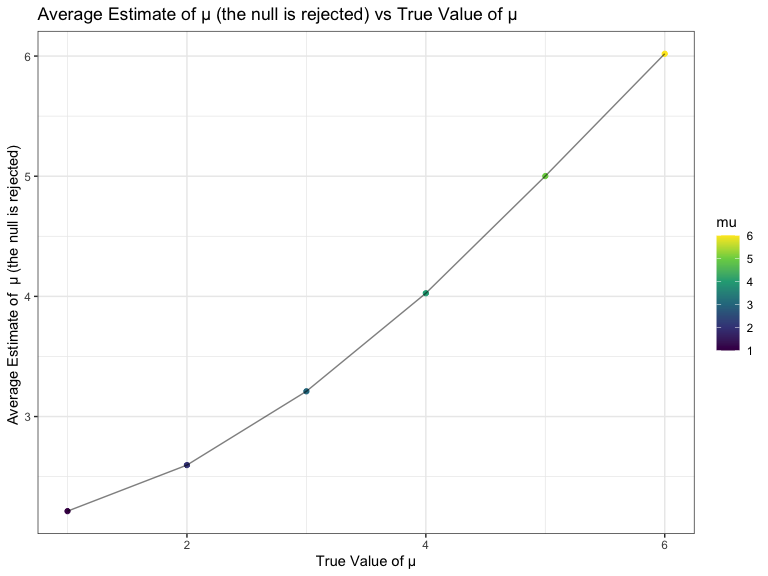

p8105_hw5_bh2849.Rmd
================
Binyue Hu
2022-11-16

### Due date

Due: November 16 at 11:59pm.

### Points

| Problem         | Points    |
|:----------------|:----------|
| Problem 0       | 20        |
| Problem 1       | –         |
| Problem 2       | 40        |
| Problem 3       | 40        |
| Optional survey | No points |

### Problem 0

This “problem” focuses on structure of your submission, especially the
use git and GitHub for reproducibility, R Projects to organize your
work, R Markdown to write reproducible reports, relative paths to load
data from local files, and reasonable naming structures for your files.
This was not prepared as a GitHub repo.

``` r
library(tidyverse)
```

## Problem 1

The code chunk below imports the data in individual spreadsheets
contained in `./data/zip_data/`. To do this, I create a dataframe that
includes the list of all files in that directory and the complete path
to each file. As a next step, I `map` over paths and import data using
the `read_csv` function. Finally, I `unnest` the result of `map`.

``` r
full_df = 
  tibble(
    files = list.files("data/zip_data/"),
    path = str_c("data/zip_data/", files)
  ) %>% 
  mutate(data = map(path, read_csv)) %>% 
  unnest()
```

    ## Rows: 1 Columns: 8
    ## ── Column specification ────────────────────────────────────────────────────────
    ## Delimiter: ","
    ## dbl (8): week_1, week_2, week_3, week_4, week_5, week_6, week_7, week_8
    ## 
    ## ℹ Use `spec()` to retrieve the full column specification for this data.
    ## ℹ Specify the column types or set `show_col_types = FALSE` to quiet this message.
    ## Rows: 1 Columns: 8
    ## ── Column specification ────────────────────────────────────────────────────────
    ## Delimiter: ","
    ## dbl (8): week_1, week_2, week_3, week_4, week_5, week_6, week_7, week_8
    ## 
    ## ℹ Use `spec()` to retrieve the full column specification for this data.
    ## ℹ Specify the column types or set `show_col_types = FALSE` to quiet this message.
    ## Rows: 1 Columns: 8
    ## ── Column specification ────────────────────────────────────────────────────────
    ## Delimiter: ","
    ## dbl (8): week_1, week_2, week_3, week_4, week_5, week_6, week_7, week_8
    ## 
    ## ℹ Use `spec()` to retrieve the full column specification for this data.
    ## ℹ Specify the column types or set `show_col_types = FALSE` to quiet this message.
    ## Rows: 1 Columns: 8
    ## ── Column specification ────────────────────────────────────────────────────────
    ## Delimiter: ","
    ## dbl (8): week_1, week_2, week_3, week_4, week_5, week_6, week_7, week_8
    ## 
    ## ℹ Use `spec()` to retrieve the full column specification for this data.
    ## ℹ Specify the column types or set `show_col_types = FALSE` to quiet this message.
    ## Rows: 1 Columns: 8
    ## ── Column specification ────────────────────────────────────────────────────────
    ## Delimiter: ","
    ## dbl (8): week_1, week_2, week_3, week_4, week_5, week_6, week_7, week_8
    ## 
    ## ℹ Use `spec()` to retrieve the full column specification for this data.
    ## ℹ Specify the column types or set `show_col_types = FALSE` to quiet this message.
    ## Rows: 1 Columns: 8
    ## ── Column specification ────────────────────────────────────────────────────────
    ## Delimiter: ","
    ## dbl (8): week_1, week_2, week_3, week_4, week_5, week_6, week_7, week_8
    ## 
    ## ℹ Use `spec()` to retrieve the full column specification for this data.
    ## ℹ Specify the column types or set `show_col_types = FALSE` to quiet this message.
    ## Rows: 1 Columns: 8
    ## ── Column specification ────────────────────────────────────────────────────────
    ## Delimiter: ","
    ## dbl (8): week_1, week_2, week_3, week_4, week_5, week_6, week_7, week_8
    ## 
    ## ℹ Use `spec()` to retrieve the full column specification for this data.
    ## ℹ Specify the column types or set `show_col_types = FALSE` to quiet this message.
    ## Rows: 1 Columns: 8
    ## ── Column specification ────────────────────────────────────────────────────────
    ## Delimiter: ","
    ## dbl (8): week_1, week_2, week_3, week_4, week_5, week_6, week_7, week_8
    ## 
    ## ℹ Use `spec()` to retrieve the full column specification for this data.
    ## ℹ Specify the column types or set `show_col_types = FALSE` to quiet this message.
    ## Rows: 1 Columns: 8
    ## ── Column specification ────────────────────────────────────────────────────────
    ## Delimiter: ","
    ## dbl (8): week_1, week_2, week_3, week_4, week_5, week_6, week_7, week_8
    ## 
    ## ℹ Use `spec()` to retrieve the full column specification for this data.
    ## ℹ Specify the column types or set `show_col_types = FALSE` to quiet this message.
    ## Rows: 1 Columns: 8
    ## ── Column specification ────────────────────────────────────────────────────────
    ## Delimiter: ","
    ## dbl (8): week_1, week_2, week_3, week_4, week_5, week_6, week_7, week_8
    ## 
    ## ℹ Use `spec()` to retrieve the full column specification for this data.
    ## ℹ Specify the column types or set `show_col_types = FALSE` to quiet this message.
    ## Rows: 1 Columns: 8
    ## ── Column specification ────────────────────────────────────────────────────────
    ## Delimiter: ","
    ## dbl (8): week_1, week_2, week_3, week_4, week_5, week_6, week_7, week_8
    ## 
    ## ℹ Use `spec()` to retrieve the full column specification for this data.
    ## ℹ Specify the column types or set `show_col_types = FALSE` to quiet this message.
    ## Rows: 1 Columns: 8
    ## ── Column specification ────────────────────────────────────────────────────────
    ## Delimiter: ","
    ## dbl (8): week_1, week_2, week_3, week_4, week_5, week_6, week_7, week_8
    ## 
    ## ℹ Use `spec()` to retrieve the full column specification for this data.
    ## ℹ Specify the column types or set `show_col_types = FALSE` to quiet this message.
    ## Rows: 1 Columns: 8
    ## ── Column specification ────────────────────────────────────────────────────────
    ## Delimiter: ","
    ## dbl (8): week_1, week_2, week_3, week_4, week_5, week_6, week_7, week_8
    ## 
    ## ℹ Use `spec()` to retrieve the full column specification for this data.
    ## ℹ Specify the column types or set `show_col_types = FALSE` to quiet this message.
    ## Rows: 1 Columns: 8
    ## ── Column specification ────────────────────────────────────────────────────────
    ## Delimiter: ","
    ## dbl (8): week_1, week_2, week_3, week_4, week_5, week_6, week_7, week_8
    ## 
    ## ℹ Use `spec()` to retrieve the full column specification for this data.
    ## ℹ Specify the column types or set `show_col_types = FALSE` to quiet this message.
    ## Rows: 1 Columns: 8
    ## ── Column specification ────────────────────────────────────────────────────────
    ## Delimiter: ","
    ## dbl (8): week_1, week_2, week_3, week_4, week_5, week_6, week_7, week_8
    ## 
    ## ℹ Use `spec()` to retrieve the full column specification for this data.
    ## ℹ Specify the column types or set `show_col_types = FALSE` to quiet this message.
    ## Rows: 1 Columns: 8
    ## ── Column specification ────────────────────────────────────────────────────────
    ## Delimiter: ","
    ## dbl (8): week_1, week_2, week_3, week_4, week_5, week_6, week_7, week_8
    ## 
    ## ℹ Use `spec()` to retrieve the full column specification for this data.
    ## ℹ Specify the column types or set `show_col_types = FALSE` to quiet this message.
    ## Rows: 1 Columns: 8
    ## ── Column specification ────────────────────────────────────────────────────────
    ## Delimiter: ","
    ## dbl (8): week_1, week_2, week_3, week_4, week_5, week_6, week_7, week_8
    ## 
    ## ℹ Use `spec()` to retrieve the full column specification for this data.
    ## ℹ Specify the column types or set `show_col_types = FALSE` to quiet this message.
    ## Rows: 1 Columns: 8
    ## ── Column specification ────────────────────────────────────────────────────────
    ## Delimiter: ","
    ## dbl (8): week_1, week_2, week_3, week_4, week_5, week_6, week_7, week_8
    ## 
    ## ℹ Use `spec()` to retrieve the full column specification for this data.
    ## ℹ Specify the column types or set `show_col_types = FALSE` to quiet this message.
    ## Rows: 1 Columns: 8
    ## ── Column specification ────────────────────────────────────────────────────────
    ## Delimiter: ","
    ## dbl (8): week_1, week_2, week_3, week_4, week_5, week_6, week_7, week_8
    ## 
    ## ℹ Use `spec()` to retrieve the full column specification for this data.
    ## ℹ Specify the column types or set `show_col_types = FALSE` to quiet this message.
    ## Rows: 1 Columns: 8
    ## ── Column specification ────────────────────────────────────────────────────────
    ## Delimiter: ","
    ## dbl (8): week_1, week_2, week_3, week_4, week_5, week_6, week_7, week_8
    ## 
    ## ℹ Use `spec()` to retrieve the full column specification for this data.
    ## ℹ Specify the column types or set `show_col_types = FALSE` to quiet this message.

The result of the previous code chunk isn’t tidy – data are wide rather
than long, and some important variables are included as parts of others.
The code chunk below tides the data using string manipulations on the
file, converting from wide to long, and selecting relevant variables.

``` r
tidy_df = 
  full_df %>% 
  mutate(
    files = str_replace(files, ".csv", ""),
    group = str_sub(files, 1, 3)) %>% 
  pivot_longer(
    week_1:week_8,
    names_to = "week",
    values_to = "outcome",
    names_prefix = "week_") %>% 
  mutate(week = as.numeric(week)) %>% 
  select(group, subj = files, week, outcome)
```

Finally, the code chunk below creates a plot showing individual data,
faceted by group.

``` r
tidy_df %>% 
  ggplot(aes(x = week, y = outcome, group = subj, color = group)) + 
  geom_point() + 
  geom_path() + 
  facet_grid(~group)
```


This plot suggests high within-subject correlation – subjects who start
above average end up above average, and those that start below average
end up below average. Subjects in the control group generally don’t
change over time, but those in the experiment group increase their
outcome in a roughly linear way.

## Problem 2

``` r
homicides = read_csv("./data/homicide-data.csv")
```

    ## Rows: 52179 Columns: 12
    ## ── Column specification ────────────────────────────────────────────────────────
    ## Delimiter: ","
    ## chr (9): uid, victim_last, victim_first, victim_race, victim_age, victim_sex...
    ## dbl (3): reported_date, lat, lon
    ## 
    ## ℹ Use `spec()` to retrieve the full column specification for this data.
    ## ℹ Specify the column types or set `show_col_types = FALSE` to quiet this message.

#### Describe the Raw Data

``` r
homicide_data = homicides %>% 
  janitor::clean_names() %>% 
  mutate(city_state = str_c(city, state, sep = ",")) 

summarize_homicide = homicide_data %>% 
  group_by(city_state) %>% 
  summarise(total_homicide = n(), 
            unsolved_homicide = sum(disposition %in% c("Closed without arrest", "Open/No arrest")))

summarize_homicide 
```

    ## # A tibble: 51 × 3
    ##    city_state     total_homicide unsolved_homicide
    ##    <chr>                   <int>             <int>
    ##  1 Albuquerque,NM            378               146
    ##  2 Atlanta,GA                973               373
    ##  3 Baltimore,MD             2827              1825
    ##  4 Baton Rouge,LA            424               196
    ##  5 Birmingham,AL             800               347
    ##  6 Boston,MA                 614               310
    ##  7 Buffalo,NY                521               319
    ##  8 Charlotte,NC              687               206
    ##  9 Chicago,IL               5535              4073
    ## 10 Cincinnati,OH             694               309
    ## # … with 41 more rows

In the `homicides` dataset, there are 52179 observations and 12
variables including uid, reported_date, victim_last, victim_first,
victim_race, victim_age, victim_sex, city, state, lat, lon, disposition.

#### Estimate the Proportion of Unsolved Homicides in Baltimore, MD

``` r
baltimore_data_df = 
  homicide_data %>%
  filter(city_state == "Baltimore,MD")

baltimore_summary = 
  baltimore_data_df %>%
  summarize(
    unsolved = sum(disposition %in% c("Closed without arrest", "Open/No arrest")),
    total = n())

baltimore_test = 
  prop.test(
    x = baltimore_summary %>% pull(unsolved),
    n = baltimore_summary %>% pull(total)) %>%
  broom::tidy() %>%
  select(estimate, conf.low, conf.high)

baltimore_test
```

    ## # A tibble: 1 × 3
    ##   estimate conf.low conf.high
    ##      <dbl>    <dbl>     <dbl>
    ## 1    0.646    0.628     0.663

#### Proportion of Unsolved Homicides and the CI for Each City

``` r
cities_test = summarize_homicide %>% 
  mutate(test = map2(unsolved_homicide,total_homicide, prop.test),
         tidy = map(test, broom::tidy)) %>% 
  select(-test) %>% 
  unnest(tidy) %>% 
  select(city_state, estimate, conf.low, conf.high)
  
cities_test
```

    ## # A tibble: 51 × 4
    ##    city_state     estimate conf.low conf.high
    ##    <chr>             <dbl>    <dbl>     <dbl>
    ##  1 Albuquerque,NM    0.386    0.337     0.438
    ##  2 Atlanta,GA        0.383    0.353     0.415
    ##  3 Baltimore,MD      0.646    0.628     0.663
    ##  4 Baton Rouge,LA    0.462    0.414     0.511
    ##  5 Birmingham,AL     0.434    0.399     0.469
    ##  6 Boston,MA         0.505    0.465     0.545
    ##  7 Buffalo,NY        0.612    0.569     0.654
    ##  8 Charlotte,NC      0.300    0.266     0.336
    ##  9 Chicago,IL        0.736    0.724     0.747
    ## 10 Cincinnati,OH     0.445    0.408     0.483
    ## # … with 41 more rows

#### Plot showing the Estimates and CIs for Each City

``` r
all_plot = cities_test %>%
  mutate(city_state = fct_reorder(city_state, estimate)) %>%
  ggplot(aes(x = city_state, y = estimate)) +
  geom_point() +
  geom_errorbar(aes(ymin = conf.low, ymax = conf.high)) +
  theme(axis.text.x = element_text(angle = 60, vjust = 0.5, hjust = 1)) +
  labs(x = "City, State", 
       y = "Estimate",
       title = "Estimated Proportion and CIs of Unsolved Homicides")

all_plot
```



## Problem 3

#### Set the Simulation

``` r
sim_normal_mean = function(n_obs = 30, mu, sigma = 5) {
  
  x = rnorm(n = n_obs, mean = mu, sd = sigma)
  
  x

}
```

#### Generate 5000 datasets from the model Setting μ=0

``` r
sim_results_1 = 
  expand_grid(
    mu = 0,
    inter = 1:5000
  ) %>%
  mutate(
    vect_num = map(mu, ~sim_normal_mean(mu = .x))
  ) %>%
  mutate(
    estimate_df = map(vect_num, t.test),
    clean_output = map(estimate_df, broom::tidy) 
  ) %>%
  unnest(clean_output) %>%
  select(estimate, p.value) %>% 
  rename(mu_hat = estimate )

sim_results_1
```

    ## # A tibble: 5,000 × 2
    ##    mu_hat p.value
    ##     <dbl>   <dbl>
    ##  1 -0.347 0.690  
    ##  2  0.256 0.763  
    ##  3  1.07  0.216  
    ##  4  0.966 0.328  
    ##  5 -1.25  0.155  
    ##  6 -2.63  0.00574
    ##  7  0.536 0.524  
    ##  8  1.01  0.259  
    ##  9  0.731 0.493  
    ## 10 -0.342 0.667  
    ## # … with 4,990 more rows

#### Repeat the Simulatio for μ={1,2,3,4,5,6,}

``` r
sim_results_2 = 
  expand_grid(
    mu = c(1:6),
    interation = 1:5000
  ) %>%
  mutate(
    vect_num = map(mu, ~sim_normal_mean(mu = .x))
  ) %>%
  mutate(
    estimate_df = map(vect_num, t.test),
    clean_output = map(estimate_df, broom::tidy) 
  ) %>%
  unnest(clean_output) %>%
  select(mu, estimate, p.value) %>% 
  rename(mu_hat = estimate )

sim_results_2
```

    ## # A tibble: 30,000 × 3
    ##       mu mu_hat p.value
    ##    <int>  <dbl>   <dbl>
    ##  1     1 -0.284   0.735
    ##  2     1  0.608   0.496
    ##  3     1  0.494   0.618
    ##  4     1 -0.144   0.866
    ##  5     1  0.604   0.533
    ##  6     1  0.389   0.679
    ##  7     1  0.265   0.737
    ##  8     1  0.188   0.838
    ##  9     1  0.811   0.417
    ## 10     1  1.51    0.101
    ## # … with 29,990 more rows

#### Plot: Power of the Test vs True Value of mu

``` r
power_test = sim_results_2 %>% 
  group_by(mu) %>% 
  summarize(total = n(),
            reject = sum(p.value < 0.05),
            power = reject/total) 

power_plot = power_test %>% 
  ggplot(aes(x = mu, y = power)) +
  geom_point(aes(color = mu)) +
  geom_line(alpha = 0.5) +
  labs(x = "True value of μ",
       y = "Power of the test",
       title = "Power of the Test vs True Value of mu") +
  theme_bw()

power_plot
```



#### Plot: Average Estimate of μ vs True Value of μ

``` r
average = sim_results_2 %>% 
  group_by(mu) %>% 
  summarize(avg_mu = mean(mu_hat))

average_plot = average %>% 
  ggplot(aes(x = mu, y = avg_mu)) +
  geom_point(aes(color = mu)) +
  geom_line(alpha = 0.5) +
  labs(x = "True Value of μ",
       y = "Average Estimate of  μ̂ ",
       title = "Power of the Test vs True Value of mu") +
  theme_bw()

average_plot
```



#### Plot: Average Estimate of μ (the null is rejected) vs True Value of μ

``` r
reject_null = sim_results_2 %>% 
  filter(p.value < 0.05) %>% 
  group_by(mu) %>% 
  summarize(avg_mu = mean(mu_hat))

avg_reject_null_plot = reject_null %>% 
  ggplot(aes(x = mu, y = avg_mu)) +
  geom_point(aes(color = mu)) +
  geom_line(alpha = 0.5) +
  labs(x = "True Value of μ",
       y = "Average Estimate of  μ (the null is rejected) ",
       title = "Average Estimate of μ (the null is rejected) vs True Value of μ") +
  theme_bw()

avg_reject_null_plot
```



Through the plots, we can conclude that the sample average of μ̂ across
tests for which the null is rejected approximately equal to the true
value of μ.
